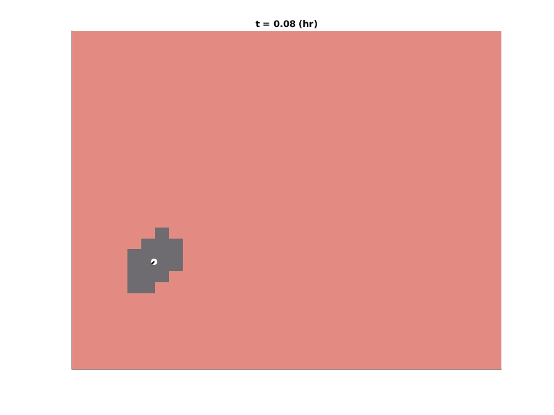

# chemotaxis-py

Python implementation of Cell Chemotaxis Simulations using the Cellular Potts Model (CPM) framework. Code is based of off my other [CPM project](https://github.com/varennes/singlecell-cpm).

Movie of simulated cell chemotaxis. Cell is moving in response to a chemical concentration profile increasing from left to right.

**`src`** directory contains all code necessary to run simulations.
